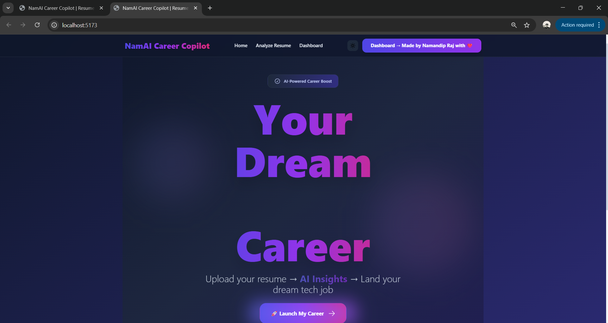
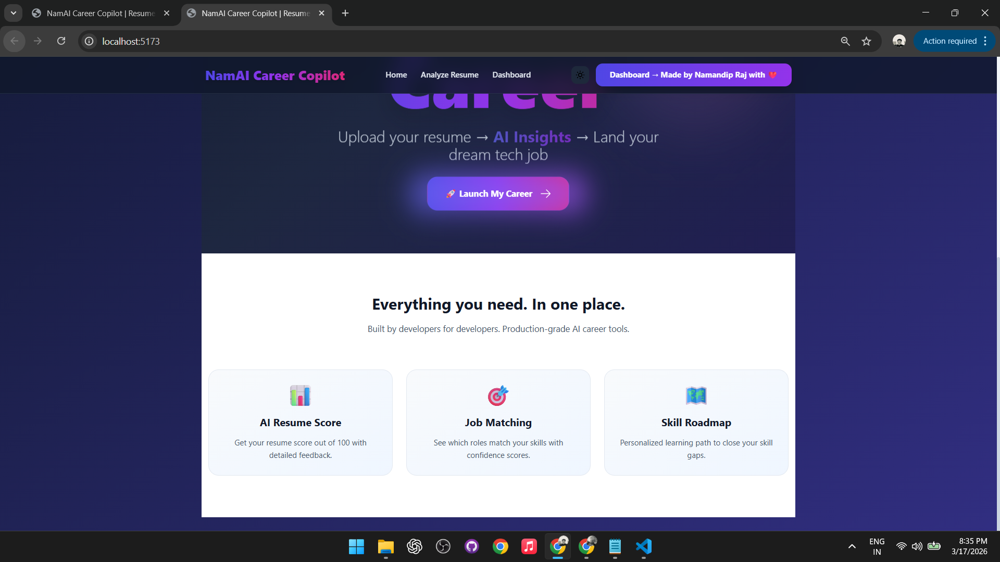
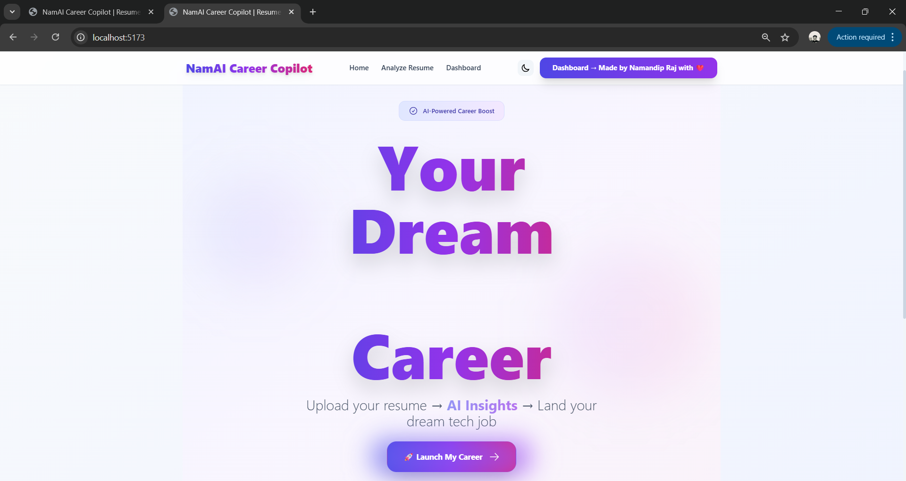
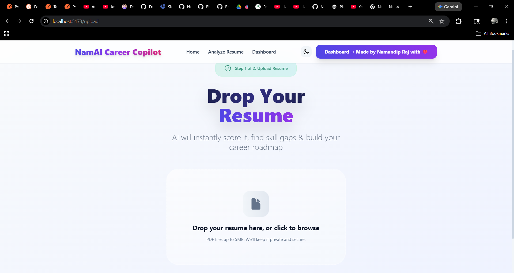
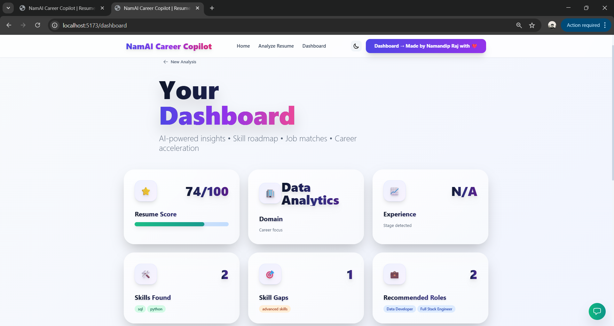
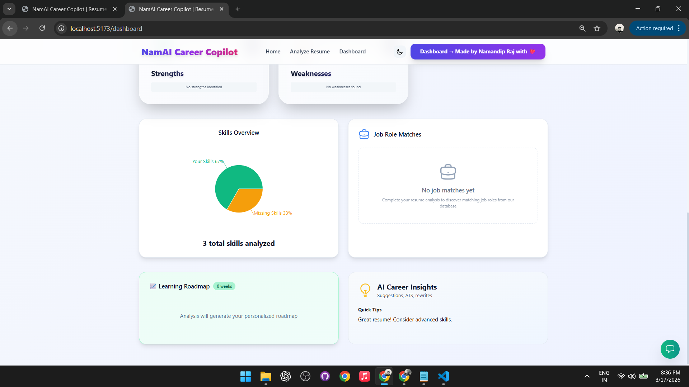
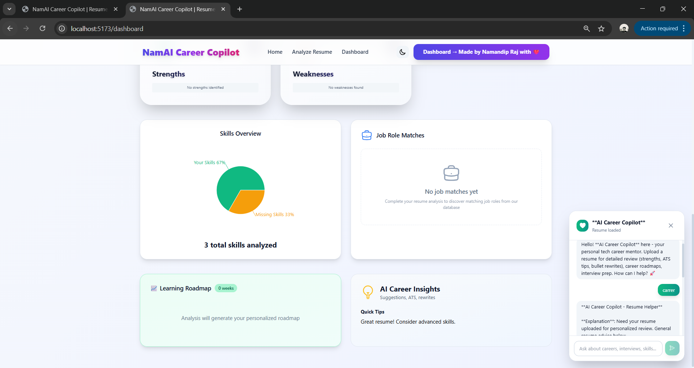
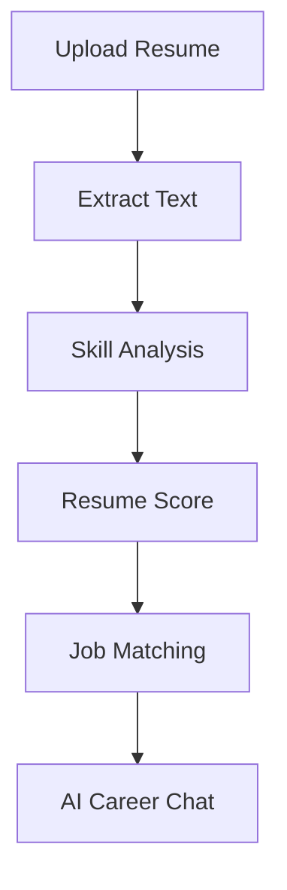

<!-- 🔥 HERO SECTION -->
<h1 align="center">🤖 NamAI Career Copilot</h1>

<p align="center">
  <b>AI-Powered Resume Analyzer & Career Assistant 🚀</b>
</p>

<p align="center">
  Transform your resume into <b>career insights, job matches, and growth strategies</b>
</p>

<p align="center">
  
  
  
  
</p>

---

## 🎬 Product Demo

<p align="center">
<video src="Video/NamAI Carrer CoPilot Working Video.mp4" width="850" controls autoplay loop muted></video>
</p>

<p align="center">
  ⚡ <b>Upload Resume → Analyze → Get Insights → Match Jobs → Chat with AI</b>
</p>

---

## 🖼️ Product Screens

<p align="center">

  

  

  



</p>

---

## ✨ Product Highlights

<div align="center">

| 🚀 Feature | 💡 What It Does |
|----------|----------------|
| 📄 Resume Upload | Drag & drop PDF → instant processing |
| 📊 Resume Score | AI evaluates resume quality |
| 📈 Skill Analysis | Visual skill strengths & gaps |
| 💼 Job Matching | Find best-fit roles |
| 🧭 Roadmap | Personalized learning path |
| 🤖 AI Chat | Career advice using LLM |

</div>

---

## 🧠 AI Workflow



---

## 🏗️ System Design

```
👤 User
   ↓
🎨 Frontend (React + Tailwind)
   ↓
⚙️ Backend (Node + Express)
   ↓
📄 Resume Parser (pdf-parse)
   ↓
🧠 Skill Extraction Engine
   ↓
🤖 Groq AI Model
   ↓
📊 Career Insights + Chat
```

---

## 🧪 Sample Output

```diff
+ Resume Score: 88 / 100

# Strengths
✔ React
✔ JavaScript

# Skill Gaps
- Node.js
- System Design

# Recommended Role
👉 Frontend Developer (92% match)
```

---

## 🚀 Run Locally

```bash
# Clone
git clone https://github.com/yourusername/namai-career-copilot.git

# Backend
cd backend
npm install
npm start

# Frontend
cd frontend
npm install
npm run dev
```

---

## ⚙️ Tech Stack

<div align="center">

| Layer | Technologies |
|------|-------------|
| 🎨 Frontend | React, Vite, Tailwind, Recharts |
| ⚙️ Backend | Node.js, Express, Multer |
| 🤖 AI | Groq API (LLM) |
| 📄 Parsing | pdf-parse |

</div>

---

## 📊 Project Impact

> 💡 This project helps users make smarter career decisions using AI

- 🚀 Faster resume evaluation  
- 📊 Clear skill gap visibility  
- 💼 Better job targeting  
- 🧠 Guided career growth  

---

## 🧩 Problem → Solution

**Problem ❌**
- No resume feedback  
- No clear career path  
- Skill gaps unknown  

**Solution ✅**
- AI Resume Analysis  
- Job Matching Engine  
- Career Guidance Chatbot  

---

## 📁 Structure

```
NamAI-Career-Copilot/
│
├── backend/
├── frontend/
├── images/
├── demo.gif
└── README.md
```

---

## 🔮 Future Enhancements

- 🧠 ATS Resume Checker  
- 🎤 AI Mock Interviews  
- 🔗 LinkedIn Analyzer  
- 🌍 Job API Integration  

---

## 👨‍💻 Author

**Naman Raj**

🚀 AI Developer | Full Stack Engineer  

---

<p align="center">
  ⭐ <b>Star this repo if you like it!</b>
</p>